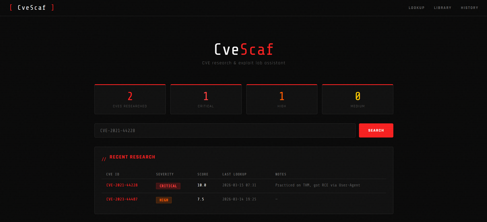
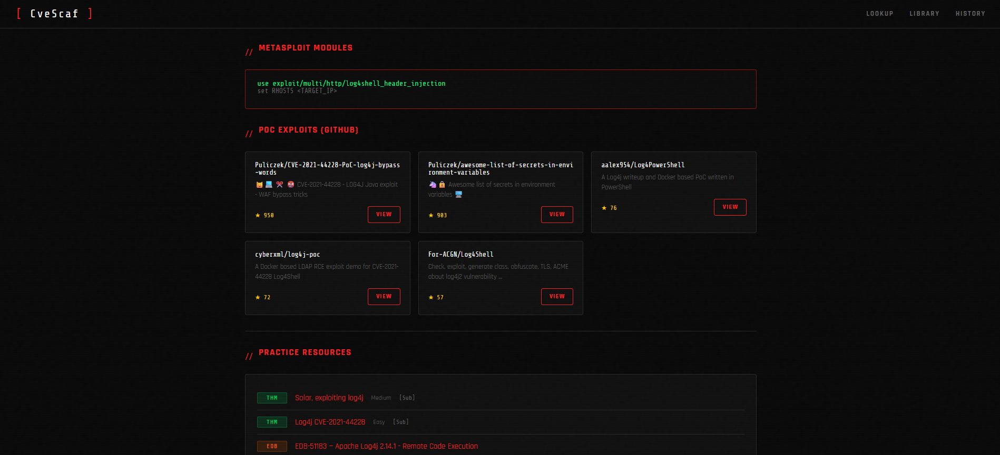
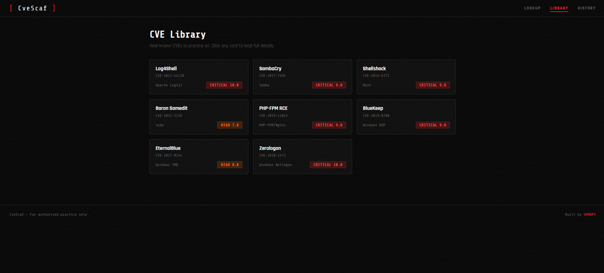
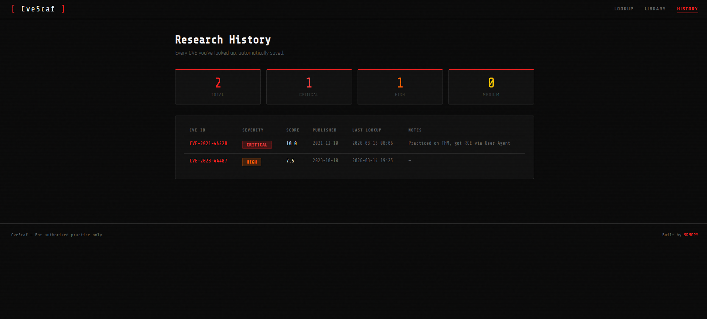

# CveScaf

A CLI tool for looking up CVEs, finding real PoC exploits, and generating structured practice notes — all from your terminal. Also comes with a local web UI dashboard.

Built for offensive security learners who are tired of spending 30 minutes setting up before they can actually practice anything.

---

## Screenshots

**Dashboard**


**CVE Detail — Log4Shell**


**Practice Library**


**Research History**


---

## What it does

You give it a CVE ID. It gives you:

- Full vulnerability details pulled live from NVD
- Real PoC repositories from GitHub (sorted by stars)
- Matching Metasploit modules
- TryHackMe rooms, HackTheBox machines, VulnHub VMs, and ExploitDB entries
- A structured markdown notes file ready to fill in as you practice
- A local history of every CVE you've researched
- A web UI dashboard to browse everything visually

```
$ python cli.py lookup CVE-2021-44228
$ python cli.py recon CVE-2021-44228
$ python cli.py resources CVE-2021-44228
$ python cli.py note-gen CVE-2021-44228
```

---

## Installation

**Requirements:** Python 3.10+, Git

```bash
# 1. Clone the repo
git clone https://github.com/SRMOPY/CveScaf.git
cd CveScaf

# 2. Install dependencies
pip install -r requirements.txt
```

No API keys, no accounts, no config files.

---

## CLI Commands

| Command | What it does |
|--------|-------------|
| `lookup <CVE>` | Fetch full CVE details from NVD — severity, score, description, references |
| `recon <CVE>` | Find PoC exploits on GitHub + Metasploit modules |
| `resources <CVE>` | Find THM rooms, HTB machines, VulnHub VMs, ExploitDB entries |
| `note-gen <CVE>` | Generate a markdown notes template saved to `/notes` |
| `list-cves` | Show a table of well-known CVEs to practice on |
| `history` | View every CVE you've looked up |
| `note <CVE> "text"` | Add a personal note to a CVE in your history |

---

## Web UI

A local dashboard built with Flask. Includes all CLI features.

```bash
python web/app.py
# Open http://localhost:5000
```

---

## Example

```bash
# Look up Log4Shell
$ python cli.py lookup CVE-2021-44228

# Find exploits and Metasploit modules
$ python cli.py recon CVE-2021-44228

# Find practice rooms
$ python cli.py resources CVE-2021-44228

# Generate notes file
$ python cli.py note-gen CVE-2021-44228
# Saved to: notes/CVE_2021_44228.md

# Add a note after practicing
$ python cli.py note CVE-2021-44228 "Got RCE via User-Agent, used marshalsec for LDAP"

# Check your history
$ python cli.py history
```

---

## Project Structure

```
CveScaf/
├── core/                  — backend logic
│   ├── fetcher.py         — pulls CVE data from NVD API
│   ├── recon.py           — searches GitHub for PoCs and writeups
│   ├── resources.py       — maps CVEs to THM, HTB, VulnHub, ExploitDB
│   ├── db.py              — local SQLite history and notes
│   └── notes.py           — generates markdown notes templates
├── web/                   — web UI
│   ├── app.py             — Flask backend
│   ├── templates/         — HTML pages
│   └── static/            — CSS and assets
├── screenshots/           — project screenshots
├── cli.py                 — entry point, all commands live here
├── requirements.txt
└── .gitignore
```

---

## Disclaimer

This tool is built for **learning and authorized practice only** — CTFs, personal labs, and platforms like TryHackMe and HackTheBox. Don't use it against systems you don't own or have explicit permission to test.

---

*Built by [SRMOPY](https://github.com/SRMOPY)*